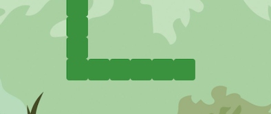
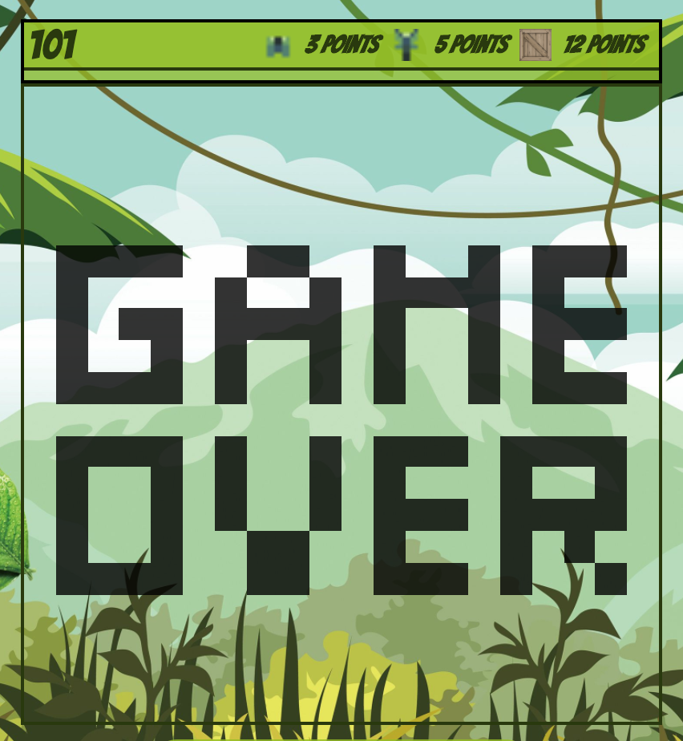
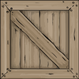
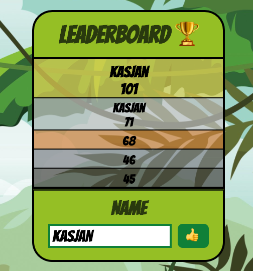
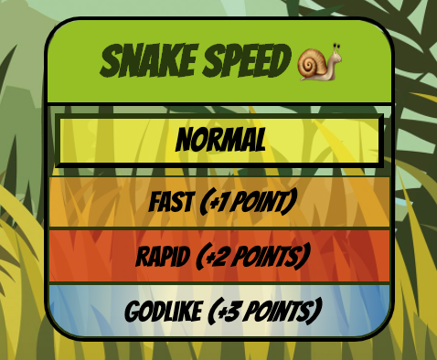
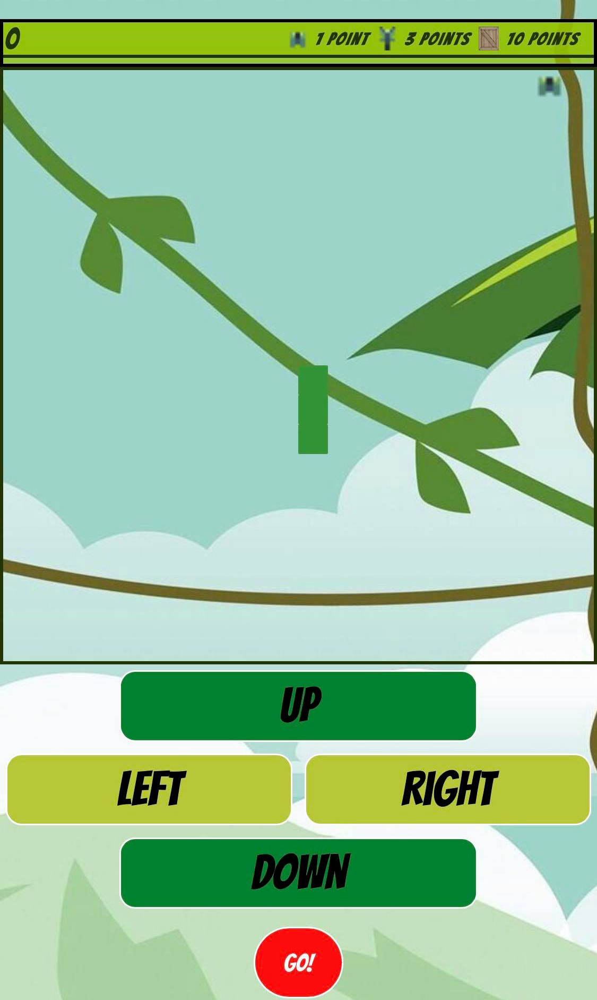
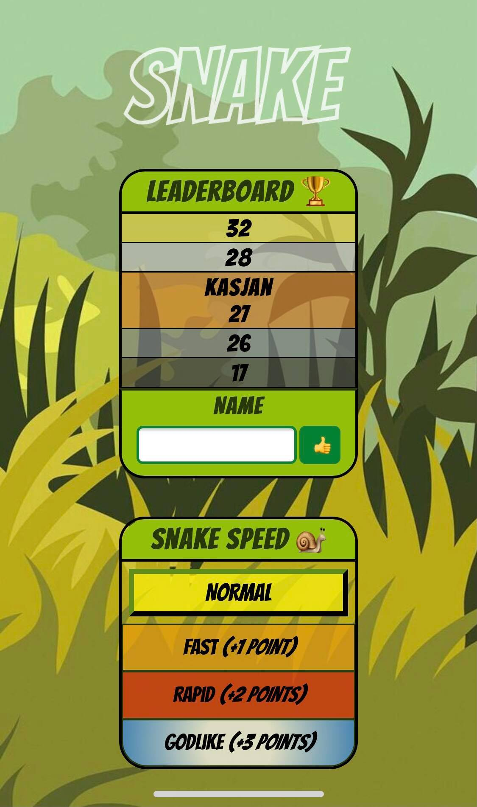
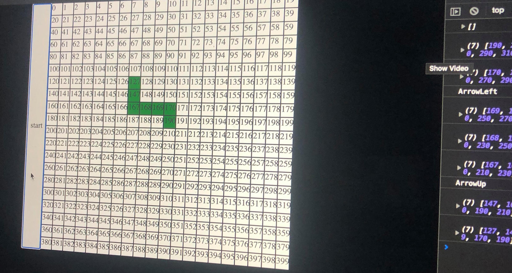

# Snake

## Overview

My first project of the Software Engineering Immersive course in General Assembly. My game was to be a grid based and function inside a browser using HTML, CSS and JavaScript. I was to use my knowledge of the past three weeks of learning to create the game individually.

[PLAY HERE](https://kasjanhinc.github.io/Snake/)

## Brief

- Create a classic snake game inside a browser.
- The snake had to have functionality such as eating food, be able to grow, be able to go through the game borders.
- The game had to be responsive.
- Implement JavaScript DOM functionality.
- Stick with KISS (Keep It Simple Stupid) and DRY (Don't Repeat Yourself) principles.
- Use best practices for writing code, such as semantic markup.
- The game should have enhancements such as a leaderboard.

**Technologies used:**

- HTML5
- CSS
- JavaScript ES6
- Git
- GitHub
- Google Fonts 
- Royalty free graphics

## Grid Layout

To create my game grid i decided to use a for loop which appends my generated cells into a .game div.

- Width was set to 20, therefore 400 cells were created inside my .game div.

```js
for (let i = 0; i < width ** 2; i++) {
  const div = document.createElement('div')
  div.classList.add('cell')
  game.appendChild(div)
  cells.push(div)
}
```

## The Snake



My snake was made in the form of an array, where each element of the array corresponded to an active cell within my grid.

```js
let snake = [210, 230, 250]
```

- Assigning my snake at the start of the game, the snake class is assigned to the cells 210, 230 and 250.

```js
snake.forEach((body) => {
  cells[body].classList.add('snake')
})
```

## Controls

To allow the player to turn the snake, event listeners were placed on the arrow keys. Each key changed the direction variable accordingly.

```js
let direction = 'up'
```

- The event listeners:

```js
window.addEventListener('keydown', (event) => {
  const key = event.key

  if (key === 'ArrowUp') {
    direction = 'up'
  } else if (key === 'ArrowDown') {
    direction = 'down'
  } else if (key === 'ArrowLeft') {
    direction = 'left'
  } else if (key === 'ArrowRight') {
    direction = 'right'
  }
})

```
## The Game Flow

The main game consists of an interval, where the snake makes a certain movement each time the interval has cycled.

- If direction is equal to up, a corresponding if statement decides how the snake should move.

```js
   const interval = setInterval(() => {

    if (direction === 'right' && (snake[0] % width !== width - 1)) {
      snake.unshift(snake[0] + 1)
      snake.pop()
      newFrame()
    }
```
## Making The Snake Follow Its Head

Here I used the .unshift method, which adds a snake[0] to the front of the snake array and .pop is used to remove the last part of the snake. This gives the illusion the snake is moving or turning throughout the grid.

- Here the snake will move up the grid.

```js
snake.unshift(snake[0] - width)
      snake.pop()
```

## Starting The Game

A event listener for the space bar starts a chain of code, reseting the game board to default values and starting a fresh interval. A lot of stuff happens:

- Jungle ambience plays in the background
- Snake rattle sound plays
- Snake is reset to ``` [210, 230, 250] ```
- The score is set to 0 inside JavaScript as well as in the HTML div containing the score for the player to see.
- Default starting snake direction is 'up'.
- Instructions, arrow key graphic, settings tab and name input disappear when the game is being played.
- Style for the bottom of the leaderboard is changed to make up for the lack of a name input.
- Removes the class .gameover for every cell in the grid.
- Runs the function startGame(), which contains the main game interval and the main logic.

```js
    ambience.play()
    audioPlayer.src = './aud/start.mp3'
    audioPlayer.play()
    snake = [210, 230, 250]
    scoreTotal = 0
    score.innerHTML = scoreTotal
    direction = 'up'

    instr.style.visibility = 'hidden'
    settings.style.visibility = 'hidden'
    keys.style.visibility = 'hidden'
    inputname.style.visibility = 'hidden'
    fifth.classList.add('fifthActive')

    for (var i = 0; i < cells.length; i++) {
      cells[i].classList.remove('gameover')
    }

    startGame()
```

## Contact And Game Over

Each time the interval runs, a contact() function is called to check if the snake has run into itself. A for loop cycles though the snake array and if a duplicate is found, the interval ends as no two snake parts can be in the same cell at once.

- Here is a snippet:

```js 
    function contact() {
      for (i = 0; i < snake.length; i++) {
        if (snake.indexOf(snake[i]) !== snake.lastIndexOf(snake[i])) {

          clearInterval(interval)
```

The game over splash screen is made up of cells which have the .gameover class assigned to them. When contact() is triggered, the following code runs:

```js
          gameover.forEach((over) => {
            cells[over].classList.add('gameover')
          })
```

```js
const gameover = [101, 102, 103, 104, 121, 141, 161, 181, 182,
  183, 184, 164, 144, 143, 186, 166, 146, 126, 107, 108, 129,
  149, 169, 189, 147, 148, 191, 171, 151, 131, 133, 111, 132,
  114, 134, 154, 174, 194, 196, 176, 156, 136, 116, 117, 118,
  157, 158, 197, 198, 221, 241, 261, 281, 301, 222, 223, 224,
  244, 264, 284, 304, 303, 302, 226, 246, 229, 249, 269, 266,
  287, 288, 231, 251, 271, 291, 311, 232, 233, 272, 273, 307,
  308, 312, 313, 236, 237, 238, 237, 238, 277, 278, 318, 235,
  255, 275, 295, 315, 258, 276, 297]
```



## Food For The Snake


There are three types of food, here is the most frequent one which generates each time the snake eats a piece on the grid. A random() function is used to assign a new piece of food to a random cell. The food is simply a .food class created in CSS. A piece of food wont generate inside the snake.

```js
let randomFood = Math.floor(Math.random() * (width ** 2))
cells[randomFood].classList.add('food')

function generateFood() {

  randomFood = Math.floor(Math.random() * (width ** 2))

  if (snake.includes(randomFood)) {
    generateFood()
  } else {
    cells[randomFood].classList.add('food')
  }
}
```
- Rare food which disappears and reappears (dragonfly and crates) works in the form of a timeout. A rare piece is placed at the start of the game, once the snake eats the first piece, a countdown triggers which will randomly place another piece in the grid. A second timer removes the piece after three seconds.

```js
setTimeout(() => {

  cells[randomRareFood].classList.add('rare')

}, 5000)

function generateRareFood() {

  setTimeout(() => {

    randomRareFood = Math.floor(Math.random() * (width ** 2))
    cells[randomRareFood].classList.add('rare')

    setTimeout(() => {

      if (randomRareFood > 0) {
        cells[randomRareFood].classList.remove('rare')
        randomRareFood = undefined
        generateRareFood()
        if (randomRareFood === undefined) {
          return
        }
      }
    }, 3000)
```


## Leaderboard

Using local storage, logic compares the score using DOM manipulation. A name can be entered and will be stored alongside the score. Logic will determine where the scoreTotal ranks within the five places available. If a player chooses not to give their name, their score will still be applied to the leaderboard.

- A snippet of the logic, in this case the score will be assigned to the fifth place on the leaderboard:

```js
function checkLeaderboard() {
  let checkHighScore = scoreTotal

  if (checkHighScore < localStorage.getItem('fourth') && checkHighScore > localStorage.getItem('fifth')) {

    localStorage.setItem('fifth', scoreTotal)
    fifth.innerHTML = scoreTotal

    if (playername !== undefined) {
      localStorage.setItem('fifthname', playername)
      fifthname.innerHTML = playername
      updateScoreNames()
    } else if (playername === undefined) {
      localStorage.setItem('fifthname', '')

      updateScoreNames()
    }
```


## Settings

Allowing the user to choose their snake speed, the points assigned when food is eaten by the snake change depending on what speed the user chooses.

- Here the normal settings is activated, the active points change to an array of integers, where each integer corresponds to the points gained depending on what food type is eaten. DOM manipulation is used to show the player the benefits of each speed type.

```js
normal.addEventListener('click', () => {
  audioPlayer.src = './aud/click.mp3'
  audioPlayer.play()
  speed = 100
  activepoints = [1, 3, 10]
  navtext1.innerHTML = '1 point'
  navtext2.innerHTML = '3 points'
  navtext3.innerHTML = '10 points'
  normal.classList.add('activeSpeed')
  fast.classList.remove('activeSpeed')
  rapid.classList.remove('activeSpeed')
  godlike.classList.remove('activeSpeed')
})
```



## Mobile Version

This CSS uses a media query to specify when the mobile version should be activated. I rearranged my flexbox properties to a column and made adjustments to the viewpoint properties to make the game aesthetically pleasing on smaller devices. Controls were added in the form of buttons, 

- A snippet of my CSS media query, in this case for portrait mode:

```css
@media only screen and (max-width: 600px) and (orientation: portrait) {

  body {
    flex-direction: column;
    width: 100vw;
    height: 190vh;
    background-image: url("./img/bgmobile.jpg");
  }
```

<!--
-->

- Landscape mode on mobile devices, a code snippet removing the .left flex container with the snake graphic:

```css
@media only screen and (max-width: 800px) and (orientation: landscape) {

  .left {
    display: none;
  }
  
```

<!---->

## Bugs (Fixed)

- Snake eating 'ghost' food and receiving points. In my dragonfly and crate if statements which checked if the snake has ate either of them, I had to assign their values to undefined after the snake ate them, so that my food logic wont pickup the same cell number in the next interval and think snake[0] is equal to the food again.
 
 This line runs after the crate has been eaten by the snake. The next cycle of the game interval wont recognise the crate cell number, not allowing the snake to eat it again. That is until my timeout generate another crate.
 
 ```js
 randomCrate = undefined
 ```
 
- Snake stopping if going 'up' and into cells[0]. The previous code said  ```else if (direction === 'up' && snake[0] > width) ``` and should be ```else if (direction === 'up' && snake[0] >= width)``` 

Without the equals the snake had no plan to ever go up from cell 20, which made him stop forever.


 
## Prototype

- Early stages here, where i was testing what cells i would need to create logic for the snake movement. For example if the snake hits the top upper cells, the new snake head (snake[0]) would be teleported to the opposite side of the grid, giving the illusion of it moving past the upper border and appearing on the bottom.



## Potential Future Features

- Server side leaderboard using backend development.
- Swipe mobile controls for the snake, and to make the game run smoother on mobile.
- Not allow dragonflies and crates to generate inside a snake cell.

## Artworks

Background
- pngtree.com

Food
- opengameart.org (public domain)

Snake graphic
- www.clipartkey.com

Snake logo
- Canva.com

